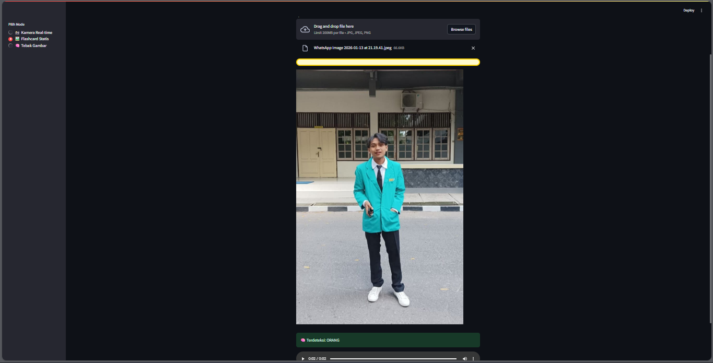
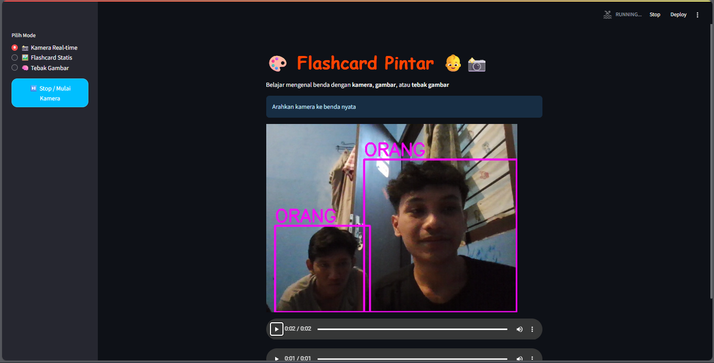
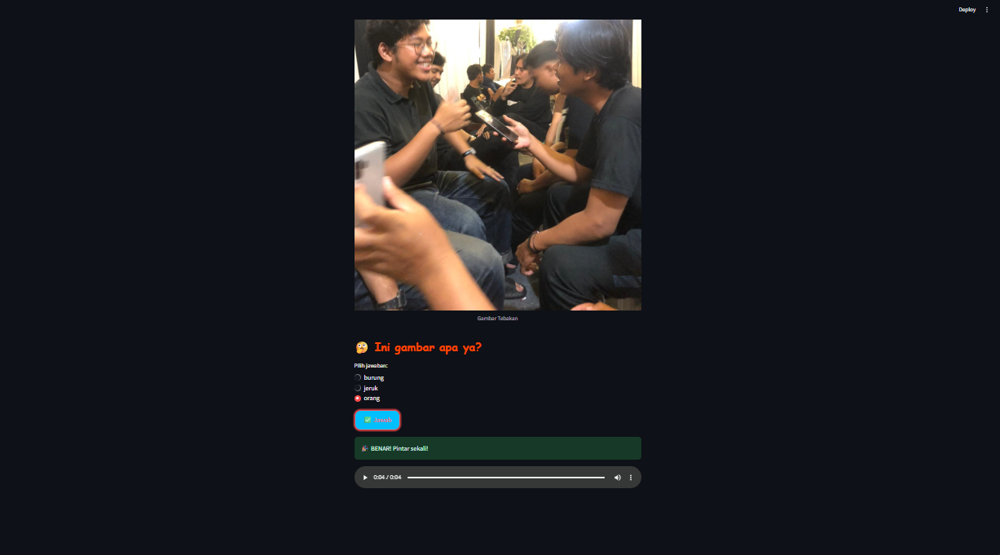

# 🎓 Flashcard Pintar Balita

Aplikasi edukatif berbasis **AI Computer Vision** untuk membantu **balita / anak usia dini** mengenal benda di sekitar melalui kamera secara **real-time**, dilengkapi **suara Bahasa Indonesia**.

---

## 📌 Deskripsi Proyek
**Flashcard Pintar Balita** merupakan aplikasi pembelajaran interaktif yang memanfaatkan teknologi **Object Detection (YOLOv8)** dan **Text-to-Speech**. Aplikasi ini mendeteksi objek nyata menggunakan webcam, menampilkan nama benda, dan mengucapkannya secara otomatis agar anak dapat belajar secara visual dan audio.

Proyek ini dirancang sebagai:
- Media pembelajaran digital anak usia dini
- Implementasi nyata AI Computer Vision
- Portofolio proyek AI Engineer non-chatbot

---

## 🎯 Tujuan
- Membantu balita mengenal benda di lingkungan sekitar
- Menggabungkan pembelajaran visual dan audio
- Memberikan pengalaman belajar yang menyenangkan dan interaktif
- Mengimplementasikan AI secara aplikatif di bidang pendidikan

---

## ✨ Fitur Utama
- 📷 **Deteksi objek real-time** menggunakan webcam
- 🧠 **YOLOv8 Object Detection**
- 🗣️ **Suara otomatis Bahasa Indonesia** (Text-to-Speech)
- 🧸 Fokus objek ramah balita (benda sehari-hari)
- 🎨 Tampilan sederhana & ramah anak

---

## 🛠️ Teknologi yang Digunakan
- **Python 3.10+**
- **Streamlit** – Web App Framework
- **YOLOv8 (Ultralytics)** – Object Detection
- **OpenCV** – Akses kamera
- **gTTS** – Text-to-Speech
- **Pillow & NumPy** – Image processing

---

## ⚙️ Instalasi & Menjalankan Aplikasi

### 1️⃣ Clone Repository
```bash
git clone https://github.com/a710230117-faris/flashcard-pintar.git
cd flashcard-pintar-balita
```

### 2️⃣ Buat Virtual Environment
```bash
python -m venv venv
venv\Scripts\activate   # Windows
source venv/bin/activate # Linux/Mac
```

### 3️⃣ Install Dependensi
```bash
pip install -r requirements.txt
```

### 4️⃣ Jalankan Aplikasi
```bash
streamlit run app.py
```

---

## 🧩 Struktur Folder
```
flashcard-pintar-balita/
│
├── app.py                 # Main aplikasi Streamlit
├── requirements.txt       # Dependensi
├── README.md              # Dokumentasi proyek
└── yolov8n.pt             # Model YOLO (opsional)
```

---

## 📊 Alur Sistem
1. Kamera aktif
2. Objek terdeteksi oleh YOLOv8
3. Label objek diterjemahkan ke Bahasa Indonesia
4. Bounding box ditampilkan
5. Suara menyebutkan nama benda

---

## 🚧 Keterbatasan
- Model masih menggunakan dataset umum (COCO)
- Membutuhkan koneksi internet untuk Text-to-Speech
- Akurasi tergantung pencahayaan

---

## 🚀 Rencana Pengembangan
- Custom model khusus objek balita
- Mode kuis & permainan edukatif
- Reward animasi & suara
- Multi-bahasa (Indonesia – Inggris)
- Offline Text-to-Speech

---

## 📸 Screenshot
## 📸 Screenshot






---

## 👨‍💻 Pengembang
**Faris Ibnu**  
Mahasiswa Pendidikan Teknik Informatika  
Universitas Muhammadiyah Surakarta

---

## 📜 Lisensi
Proyek ini dibuat untuk keperluan **edukasi dan pembelajaran**.

---

⭐ Jika proyek ini bermanfaat, jangan lupa beri **star** di GitHub!

